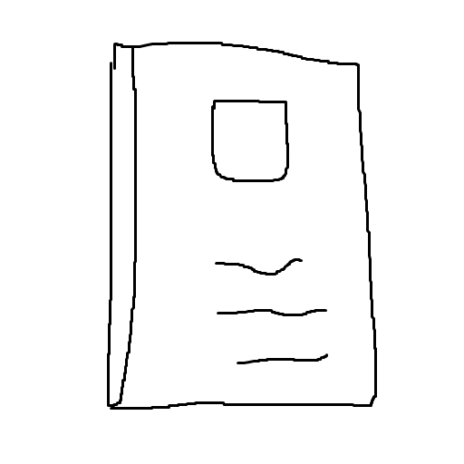

<p align="center">
  
</p>

<h1 align="center">Notes</h1>

<span>Quick start</span>

[Development](./readme/development.md)

[Deployment](./readme/deployment.md)

---

<h1 id="Quick start">Quick start</h1>

<h2>0. Get the site ready</h2>

- Option 0: visit GitHub page

  <a href="https://shampooma.github.io/notes/">https://shampooma.github.io/notes/</a>

- Option 1: Host the website by docker

  ```bash
  git clone -b main https://github.com/shampooma/notes.git
  cd notes
  sed -i 's/PROCESS_MODE=.*/PROCESS_MODE=prod/' .env
  ./start.sh build
  ./start.sh up -d
  ```

  visit: <a href=http://localhost:9000>http://localhost:9000</a>

- Option 2: Host the website directly

  ```bash
  git clone -b main https://github.com/shampooma/notes.git
  cd notes
  npm ci --production
  npm run build
  npm run serve
  ```

  visit: <a href=http://localhost:9000>http://localhost:9000</a>

<h2>1. Install on mobile phone</h2>

Find a way for `Add to home screen`
