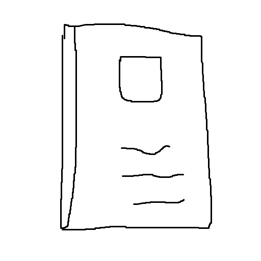

<p align="center">
  
</p>

<h1 align="center">Notes</h1>

[Quick start](../README.md)

[Development](./development.md)

<span>Deployment</span>

---

<h1>Deployment</h1>

<h2>0. Procedures</h2>

<h3>0.0. Get the site ready</h3>

- Option 0: use docker

  ```sh
  sed -i 's/PROCESS_MODE=.*/PROCESS_MODE=prod/' .env
  ./start.sh build
  if [ -e ./docs ]; then rm -r ./docs; fi
  mkdir ./docs
  ./start.sh up -d
  docker cp notes_prod_1:/app/public/. ./docs/
  ./start.sh down
  ```

- Option 1: use npm directly

  ```sh
  npm run build --prefix-paths
  if [ ! -e ./docs ]; then mkdir ./docs; else rm -r ./docs/*; fi
  cp -r ./public/* ./docs/
  ```

<h3>0.1. Push to GitHub</h3>

```sh
git pull origin dev
git add .
git commit -m "new commit"
git push origin dev
```

<h3>0.2. Create pull request</h3>

<h2>1. Hints</h2>
<h3>1.0. Path prefix</h3>

When push to GitHub the website is in the path /notes, navigation in the app could achieved by:
- Setting `pathPrefix: '/notes'` in `gatsby-config.js`,
- Use `--prefix-paths` for `build` and `serve`

<h3>1.1. GitHub page building source</h3>

GitHub page is built from the `/docs` folder in the `main` branch
